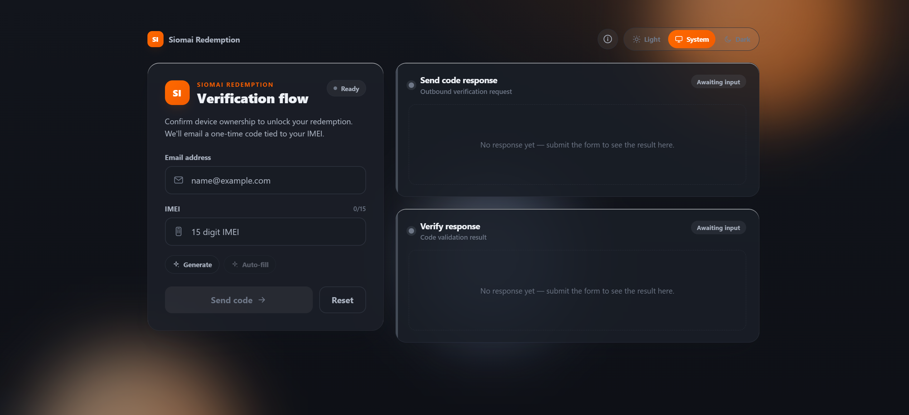

# Siomai Redemption

> Get a **Spotify Premium** redemption link using your device's IMEI.

---

## 📖 About

**Siomai Redemption** provides a **Spotify redemption link** based on your device
**IMEI**. After a successful request, the redemption link is delivered to the
email you provided — granting **3–4 months of Spotify Premium**.

You simply enter your email and IMEI, receive a one-time verification code by
email, enter it, and the redemption link is sent your way.

---

## ✨ Features

- 🎁 **Spotify Premium redemption** — 3–4 months, delivered to your email.
- 📱 **IMEI verification** — validates your device IMEI before redeeming.
- ✉️ **One-time email code** — secure two-step send → verify flow.
- 🧪 **IMEI helpers** — **Generate** a valid IMEI or **Auto-fill** the missing digits.
- 💬 **Clear status messages** — friendly, human-readable results (no raw logs).
- 🌗 **Light / Dark / System theme** — with your preference remembered.
- ℹ️ **Built-in About guide** — opens automatically on your first visit.

---

## 🚀 How to use

1. Enter your **email address**.
2. Enter your 15-digit **IMEI** — or tap **Generate** / **Auto-fill**.
3. Press **Send code** — a verification code is emailed to you.
4. Enter the code and press **Verify**.
5. Read the outcome in the response panel — on success, check your email for the
   **Spotify redemption link**.

> ⚠️ **Seeing “Risk reject”?**
> It means your current IP has been flagged or detected by the brand.
> Switch to a **proxy or VPN** and try again.

---

## 👥 Credits

| | Member | Role |
|---|--------|------|
| 🧑‍💻 | **[PHC - Nicxs](https://phcorner.org/members/1568161/)** | Web Developer |
| 🎨 | **[PHC - Brendan666](https://phcorner.org/members/2539053/)** | Web Designer and Developer |

---

Developer / technical documentation lives in **CLAUDE.md**.
